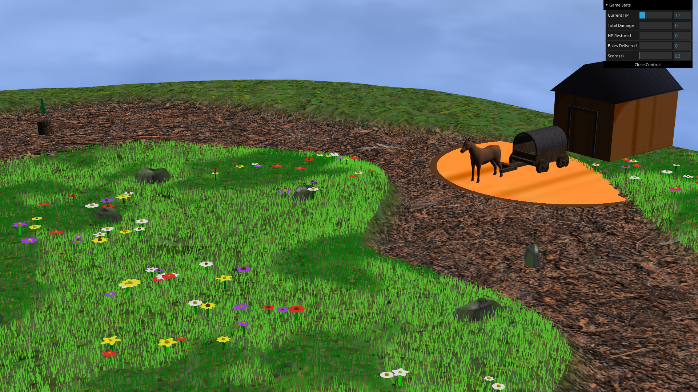
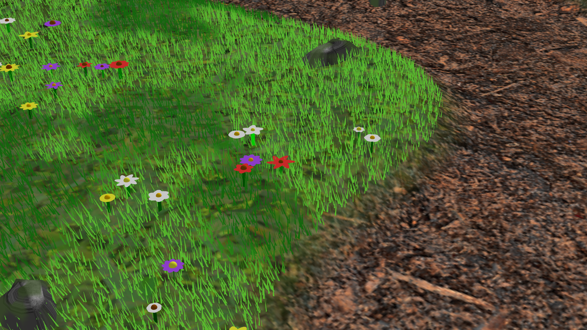
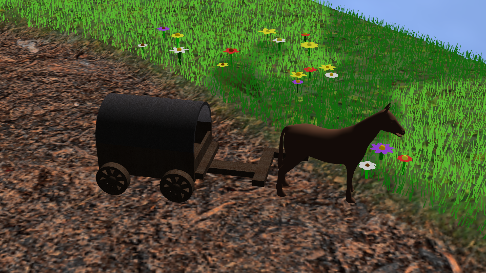
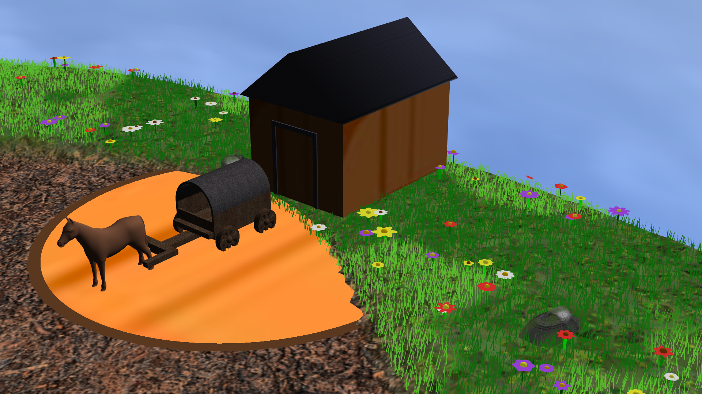

# CGRA - Group T09G08


**Group Members:**

- Luís Bento — 202305866
- Tiago Rodrigues — 202304399
- Luís Freitas — 201905767

---

## Brief description of the scene

This project implements a WebGL 3D scene using the provided CGF framework. The scene contains a textured terrain, sky/sun lighting, flora (flowers and grass patches), rocks, a barn area with bales, and a wagon. The scene demonstrates camera controls, basic animations, texture mapping and simple GLSL shaders for lighting.


## How to run

Dependencies:

- A modern WebGL-capable browser (Chrome, Firefox)
- A local HTTP server to serve files (browsers restrict some file access when opened via file://)

Run steps:

1. Start a simple server (Python 3):

```bash
python3 -m http.server 8000
```

2. Open the scene in your browser:

http://localhost:8000/project/index.html

Alternative: use Live Server extension on VsCode.

## Keyboard controls

| Key | Action |
|-----|--------|
| WASD | Move wagon |
| L | Drop hale(s) when in drop off zone |
| P | Pick up hale when wagon its on it's side |


## Implemented features

- Skybox and directional sun lighting
- Textured terrain with configurable shaders
- Rock field and scattered objects
- Flora systems: flower patches and grass fields
- Barn area containing stacked bales
- Movable wagon with simple animation controls


## Known issues / limitations

- Performance may degrade on low-end GPUs when many instances are visible
- Some models or textures require serving over HTTP

## Screenshots


1. 
2. 
3. 
4. 
5. 


## AI use declaration

In the development of this project, we made use of AI tools as a support resource rather than as a substitute for our own work. Specifically, AI was used to assist in generating the geometry of certain shapes - such as the petals of the flowers - by helping us define vertices, normals, and texture coordinates more efficiently. It was also used as a debugging aid, helping us identify and understand errors in our code, interpret unexpected rendering behaviour, and reason about issues such as incorrect texture mapping, shader logic, and transformation order.
All AI-assisted output was reviewed, tested, and adapted by us to fit the project's requirements, and we take full responsibility for the final implementation and its correctness. The overall design, structure, and integration of the project are our own work.