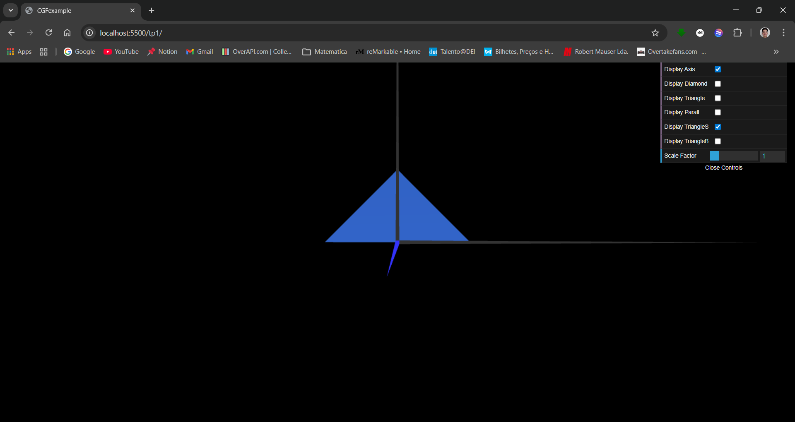
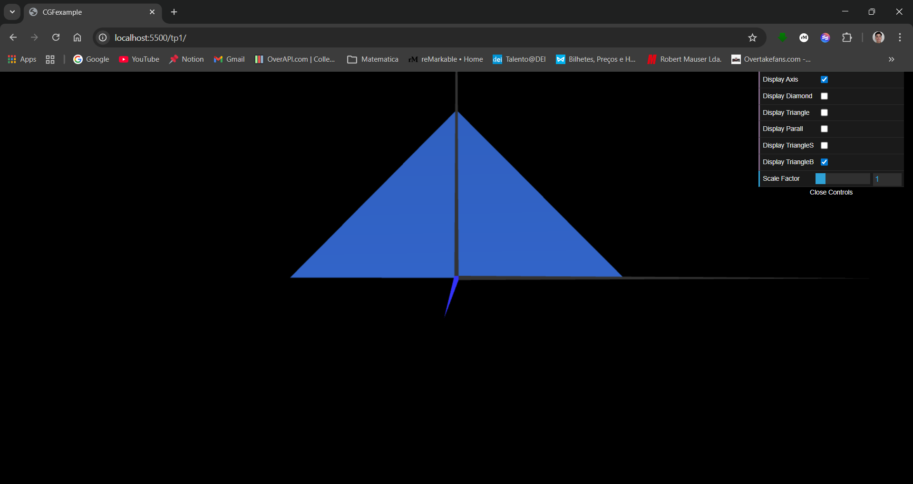

# CG 2025/2026

## Group T09G08

## TP 1 Notes

- In Exercise 1, we learned how to declare vertices and how to create triangles using those vertices. We also observed that, depending on how we define the indices, the triangles are visible from one side but not from the other.
- In Exercise 2, we observed how the size of the triangle affects the viewing range.

