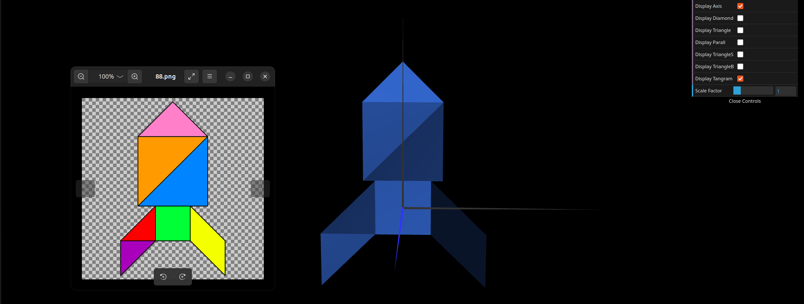
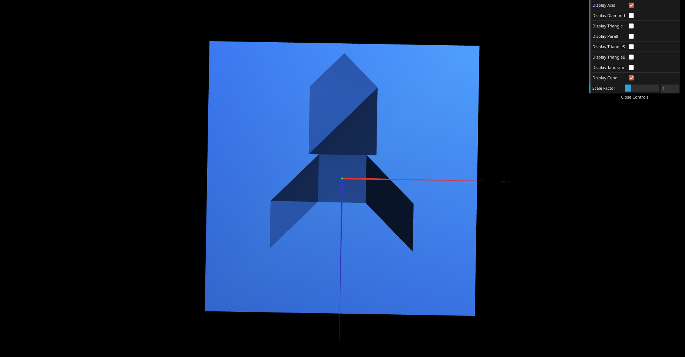
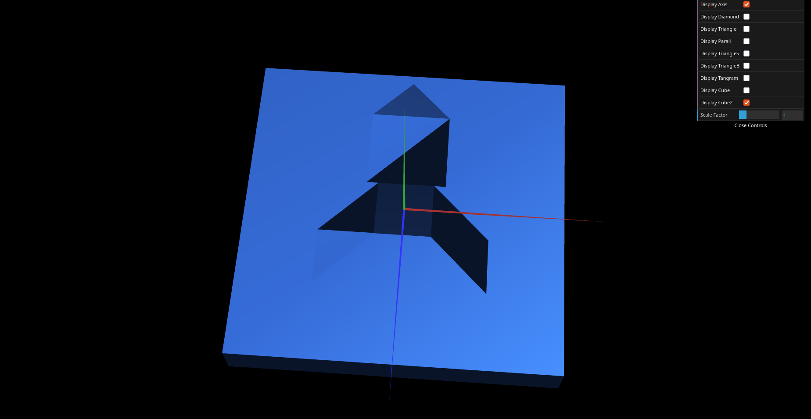

# CG 2025/2026

## Group T09G08

## TP 2 Notes

- In Exercise 1, we learned how to apply **graphical transformations** — **translation, rotation, and scaling** — to construct a Tangram (Number 88). Using basic geometric shapes such as diamonds and triangles, we applied these transformations to correctly position and orient each piece, ultimately reproducing the final figure shown in the image.

- In Exercise 2, we constructed a cube by defining **eight vertices** and using them to create triangular faces that form the six sides of the cube, ensuring that it is centered at the origin (0, 0, 0). Afterwards, we displayed the tangram and applied a **rotation transformation** so that it becomes parallel to the XZ plane.

- In Exercise 3, we constructed the same cube as in Exercise 2. However, instead of defining all the vertices and triangles needed to represent the cube, we first created a single face (**MyQuad.js**). By applying graphical transformations such as translations and rotations, we replicated and positioned this face to form the complete cube, simplifying the implementation.

