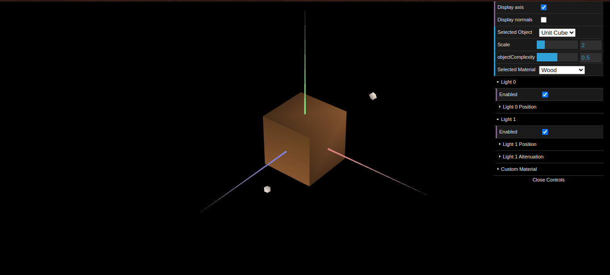
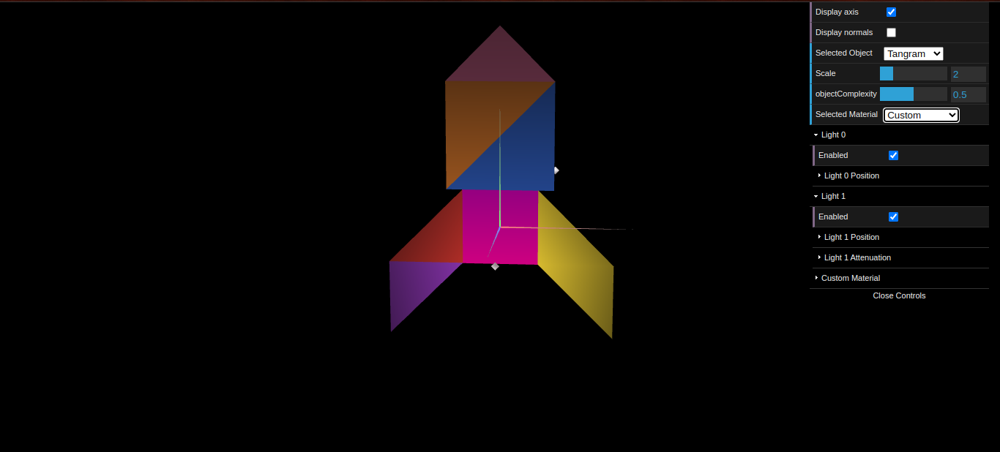
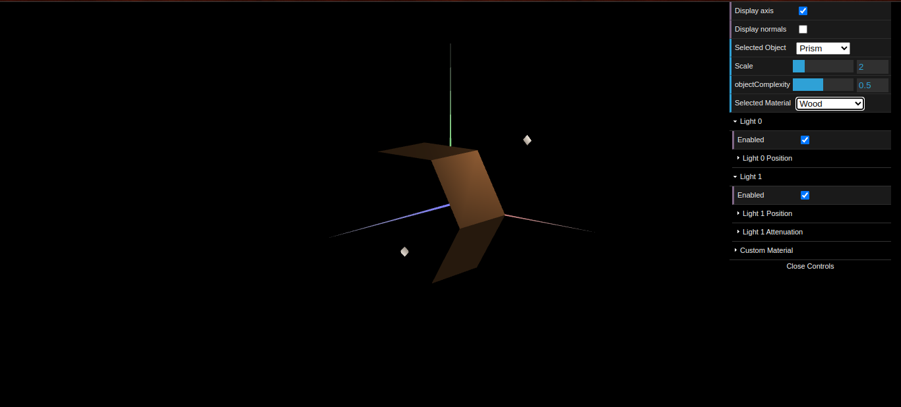
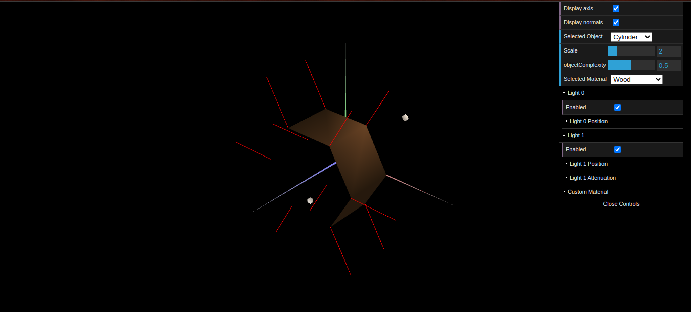

# CG 2025/2026

## Group T09G08

## TP 3 Notes

- **Part 1 - Lighting and tangram materials**

In this part, we explored the lighting pipeline by configuring materials (ambient, diffuse, specular, and shininess) and applying them to the scene. We used the Tangram to observe how different material parameters react under scene lights, and we validated the results with normal visualization and interactive controls.

- **Part 2 - Drawing a prism**

We implemented `MyPrism` with a variable number of `slices` and `stacks`, inscribed in a cylinder of radius 1 and height 1 along the `Z` axis (open ends). The geometry was generated procedurally through vertices, indices, and normals. Normals were defined per face, which emphasizes the edges and creates a faceted appearance.

- **Part 3 - Cylindrical Surface - Application of Gouraud shading**

Starting from the prism, we created `MyCylinder` and changed the normal of each vertex to be perpendicular to the ideal cylindrical surface. We also simplified the mesh by removing duplicated vertices/normals and reusing indices. With shared radial normals, lighting transitions became smooth (Gouraud-like interpolation), making the surface appear curved.

