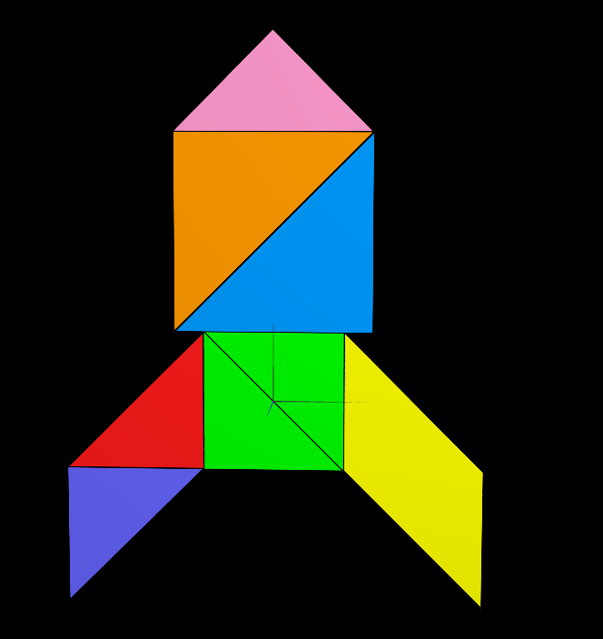
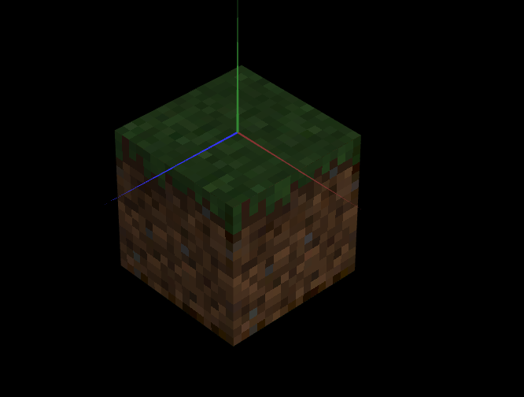

# CG 2025/2026

## Group T09G08

## TP 4 Notes

- **Part 1 - Tangram Texture**

In this part, we learned how to use texture coordinates (texCoords) to correctly map specific portions of a texture onto each figure. This ensures that each shape displays the appropriate section of the image.

- **Part 2 - QuadCube Minecraft Texture**

In this part of the project, we applied a Minecraft dirt block texture to a cube. To preserve the visual quality of the texture—despite its low resolution (16×16 pixels)—we used a nearest filter. This prevents blurring and keeps the texture sharp and pixelated, maintaining the characteristic Minecraft style.

