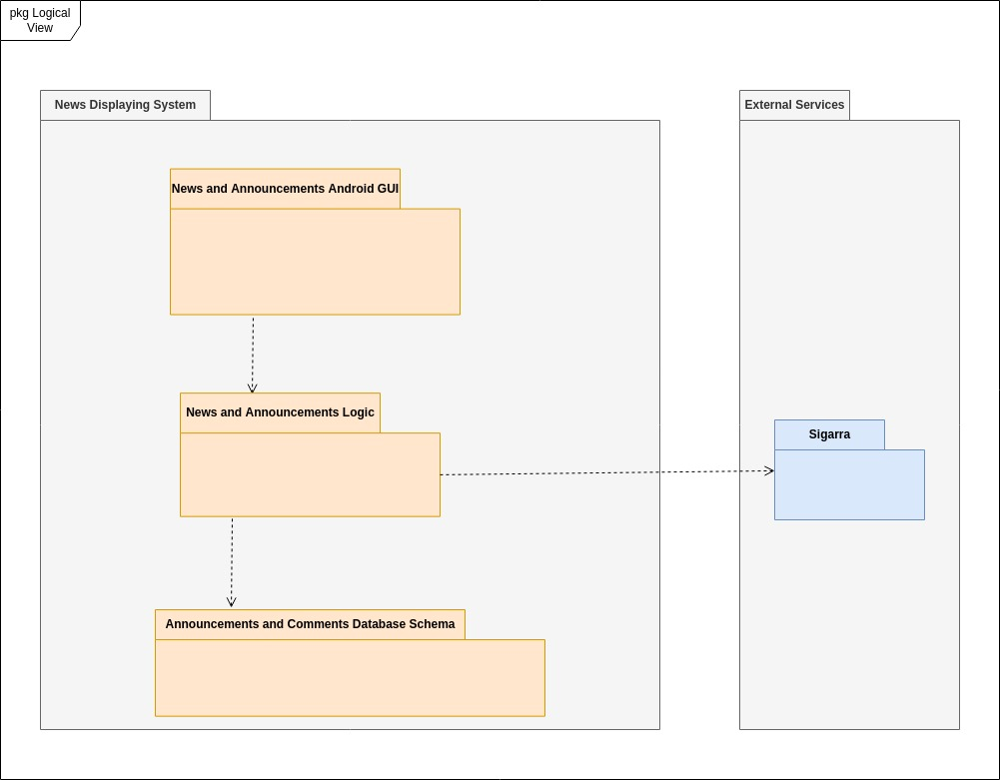
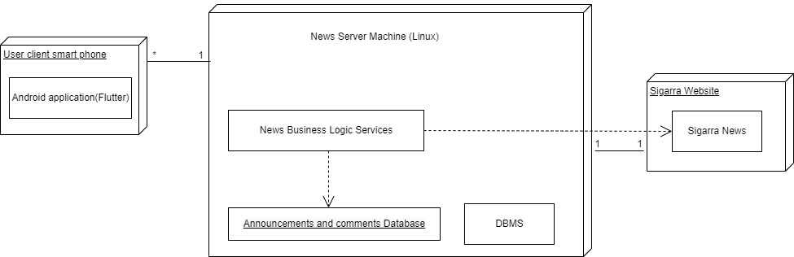
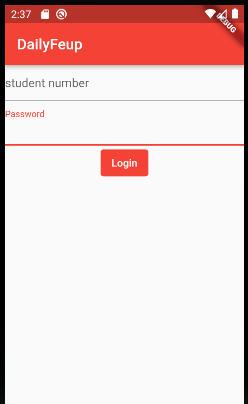

## Architecture and Design

### Logical architecture

  

### Physical architecture

  

### Vertical prototype

We implemented:
- the login page - a form to allow the user to input his student number and password. It has two TextFormFields and an ElevatedButton.

  

- the list of news topics and the list of announcements - a list of containers each of which represent a topic 

  

- the list of announcements - same as the list of news topics, but each container represents an announcement. It also has a Floating Action button used to add an announcement (for logged in users)

  

- the news - we used an image object to represent the image of the news

  

