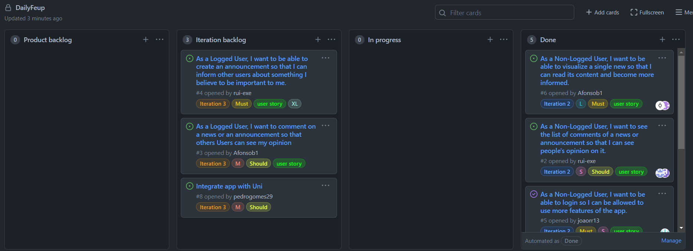

## Iteration retrospectives

### Iteration 1

- What went well?  
By seeing what each of us was working on, we avoided some tasks that would have been wasted.  
We successfully developed and tested all features that implemented the user stories planned for this iteration.
- What didn't go so well?  
We took longer than expected to develop the tests
- What have we learned?   
How to develop a mobile app with flutter  
How to use flutter tests and gherkin for unit and integration tests
- What still puzzles us?  
Why did it take so long to develop the integration tests?

### Iteration 2
- What went well?  
We managed to do the required tests a lot faster than in the previous iteration, as we were more used to gherkin.
- What didn't go so well?  
Unanticipated requirements change (need to integrate app with Uni) lead to wasting time developing part of a useless feature (log in page).
- What have we learned?   
Eventhough we haven't yet used it, we learned more about http requests, and how to validate a login from sigarra in our own app.  
- What still puzzles us?  
We always allocate less time than we should to building the tests and we always end up needing to allocate more time, eventhough there a was a significant improve from the last iteration in this particular thing.

  
  
  ### Iteration 3
- What went well?  
We succeeded in implementing everything that we envisioned for the app, even managing to successfuly webscrape the Sigarra website.
- What didn't go so well?  
  It was really stressfull trying to integrate our app with the Uni app. We had to change basically our entire back-end code in just a short space of time due 
  to that factor.   We also lost a ridiculous amount of time with developing the acceptance tests, mainly because we had to find a way to validate a "default" user
  into Sigarra since we didn't want to hardcode our username and password. 
  Lastly and speaking in a general and global perspective of this project, we lost a really absurd amount of time with some smaller logical errors because we nearly     had no experience with the Flutter framework or with the Gherkin tool , so we were basically walking in the dark with a not so powerful flashlight. A lot of resilience was needed to fight against those obstacles and overcome them.
  
- What have we learned?   
As a consequence of the things that didn't go so well, we now possess a really decent understanding of the Flutter framework and we also learned that sometimes 
  things can't always be smooth sailing.  
- What still puzzles us?  
We had a lot of trouble getting our tests to pass because, in order to automatize those tests, we needed to automatize everytime we had to scroll in the app. We tried a lot of scroll methods from different classes and we eventually managed to get it right, but we are still a bit confused to why those said methods did not work.    
  

