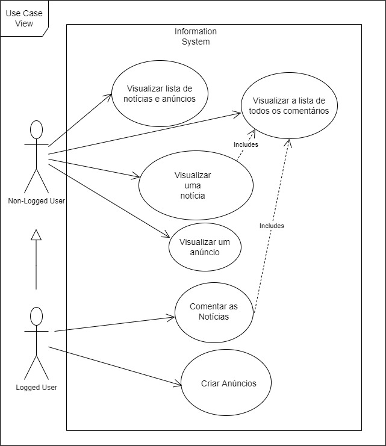
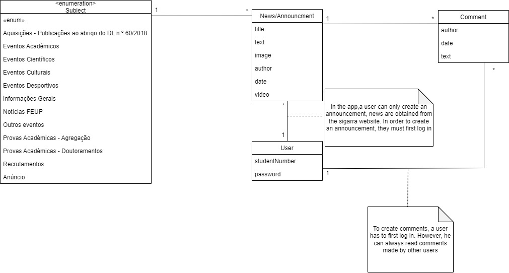

### Use case model 

 

  

|||
| --- | --- |
| *Name* | Visualizar lista de notícias e anúncios.|
| *Actor* | Non-Logged User. |
| *Description* | O utilizador terá acesso a uma lista com várias notícias e anúncios, onde poderá escolher a que pretende visualizar.|
| *Preconditions* | - |
| *Postconditions* | Ter acesso de uma forma organizada às notícias e anúncios da FEUP. |
| *Normal flow* | 1. O utilizador abre a aplicação tendo acesso à lista de notícias e anúncios. |
| *Alternative flows and exceptions* | - |

 

|||
| --- | --- |
| *Nome* | Visualizar uma notícia |
| *Ator* |  Non-logged user | 
| *Description* | O utilizador visualiza uma única notícia da aplicação, clicando numa notícia que está presente na lista de notícias/anúncios. |
| *Pre-condições* | Existir pelo menos uma notícia existente na lista de notícias/anúncios |
| *Pós-condições* | Ter acesso ao conteúdo da notícia.|
| *Normal flow* | 1. O utilizador clica numa notícia presente na lista de todas as notícias/anúncios.  2. A aplicação disponibiliza o conteúdo da notícia ao utilizador.  3. O utilizador decide se irá ler o conteúdo da notícia.  4. Se o utilizador pretender pode também acessar a lista de todos os comentários|
| *Alternative flows and exceptions* | -

 

|||
| --- | --- |
| *Name* | Visualizar a lista de todos os comentários. |
| *Actor* |  Non-logged user | 
| *Description* | Visualizar a lista de todos os comentários da notícia atual. |
| *Preconditions* | Estar atualmente a visualizar a notícia e fazer scroll até ao seu final |
| *Postconditions* | Ter acesso aos comentários feitos por outras pessoas da notícia atual.
| *Normal flow* | 1. O utilizador faz scroll até ao fim da notícia.  2. O utilizador visualiza os comentário da mesma, bem como o seu autor e a sua data.
| *Alternative flows and exceptions* | - |

 

|||
| --- | --- |
| *Name* | Comentar as Notícias|
| *Actor* |  Logged User| 
| *Description* | O utilizador pode escrever um comentário para uma notícia. |
| *Preconditions* | - O utilizador deve estar autenticado   - Estar na página de uma noticia.|
| *Postconditions* | - O comentário fica guardado na base de dados. |
| *Normal flow* | 1. O utilizador abre a aplicação e autentica-se.   2. Escolhe uma noticia.   3. Escreve o comentário.  4. Clica para enviar o comentário. |
| *Alternative flows and exceptions* | - |

 

|||
| --- | --- |
| *Nome* | Visualizar um anúncio |
| *Ator* |  Non-logged user | 
| *Description* | O utilizador visualiza um único anúncio da aplicação, clicando num anúncio que está presente na lista de notícias e anúncios. |
| *Pre-condições* | Existir pelo menos um anúncio existente na lista de notícias/anúncios |
| *Pós-condições* | Ter acesso ao conteúdo do anúncio.|
| *Normal flow* | 1. O utilizador clica num anúncio presente na lista de todas as notícias/anúncios.  2. A aplicação disponibiliza o conteúdo do anúncio ao utilizador.  3. O utilizador decide se irá ler o conteúdo do anúncio.
| *Alternative flows and exceptions* | -

 

|||
| --- | --- |
| *Name* | Criar anúncios |
| *Actor* |  Logged User | 
| *Description* | O utilizador logado na aplicação pode criar um ou mais anúncios, conforme os seus objetivos, através da opção "Criar anúncio". |
| *Preconditions* | - O utilizador não logado tem de fazer login na conta registada na app.   |
| *Postconditions* | - O utilizador logado tem a opção de visualizar a sua própria lista de anúncios criados.    - Todos os anúncios ficam disponíveis para visualização quer seja para utilizadores logados ou não logados.|
| *Normal flow* | 1. O utilizador logado acessa a opção de "Criar anúncios" disponível na app.  2. O sistema mostra a lista atual de anúncios disponíveis.  3. O utilizador logado tem um exemplo de anúncio pré-definido, de forma a facilitar o acesso a esta opção.  4. Se desejado, o utilizador pode personalizar o anúncio através das categorias disponíveis.  5. O sistema tem uma função de correção automática e deteção de erros, tal como detetar a alteração do formato original do anúncio.  6. Depois de concluída a criação do anúncio, o sistema mostra a opção "Voltar à página inicial".
| *Alternative flows and exceptions* | -

 

### Domain model

  

