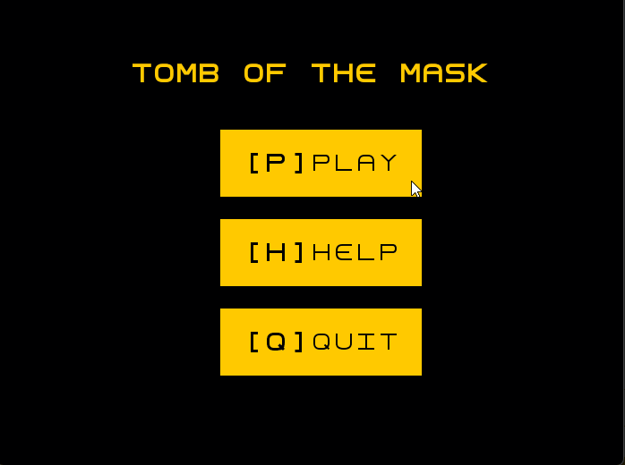
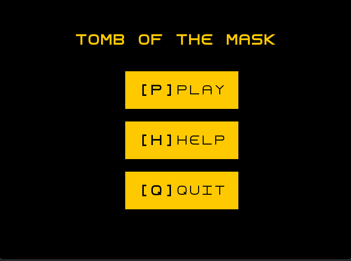
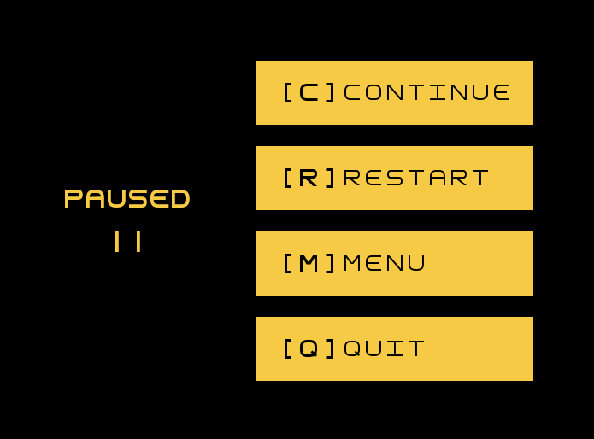
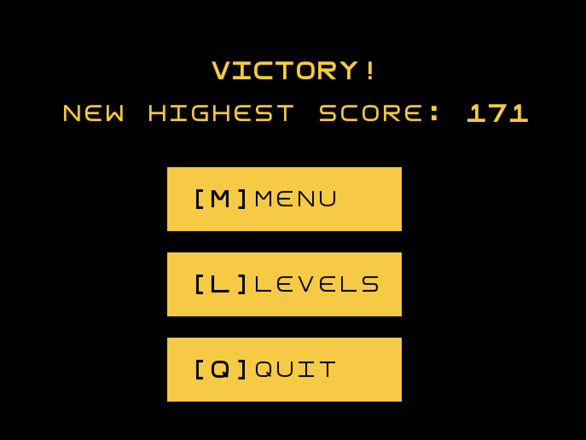

## LDTS_0801 - Tomb of the Mask

In this game, embark on an adventurous journey through labyrinths full of traps and challenges.  
The gameplay requires you to guide a character equipped with a mask that allows it to navigate through the maze by sticking to walls.  
However, you should be careful not to stick to the spikes! Contact with them will harm your character, leading to a game over...  
Navigate the labyrinth strategically, avoiding hazards and collecting all stars to reach the final destination. You can also collect coins along the way to enhance your score.

This project was developed by *Luís Freitas* (*up201905767*@fe.up.pt), *Mariana Marques* (*up201606434*@fe.up.pt), and *Pedro Marques* (*up202107525*@fe.up.pt) for LDTS 2023⁄24.

### SCREENSHOTS

**GAMEPLAY LVL 1**

**GAMEPLAY LVL 2**

**PAUSE**

**VICTORY**

### Self-Evaluation

- Mariana Marques: 33%
- Luís Freitas: 33%
- Pedro Marques: 33%
