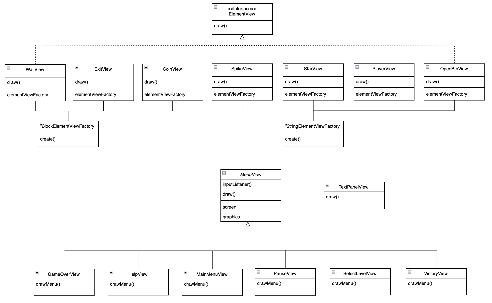
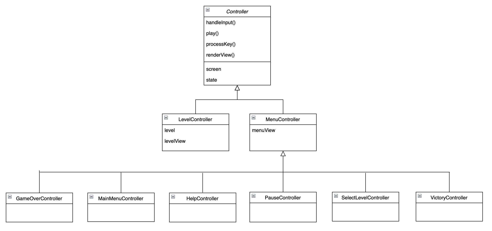
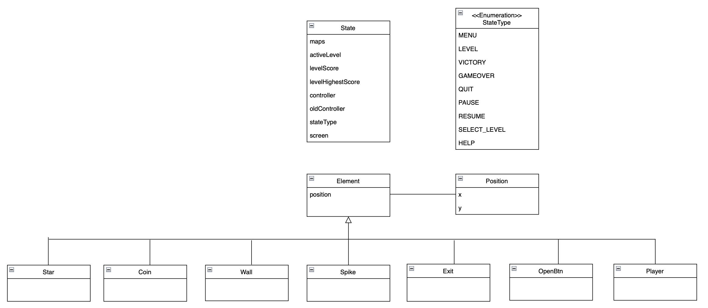
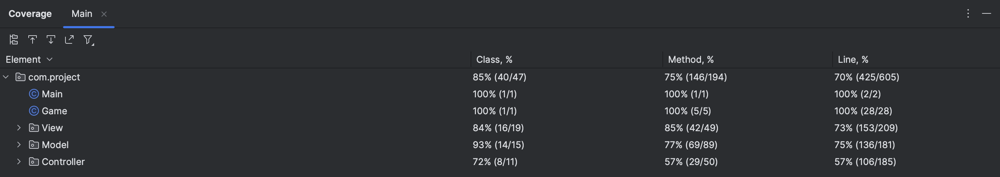
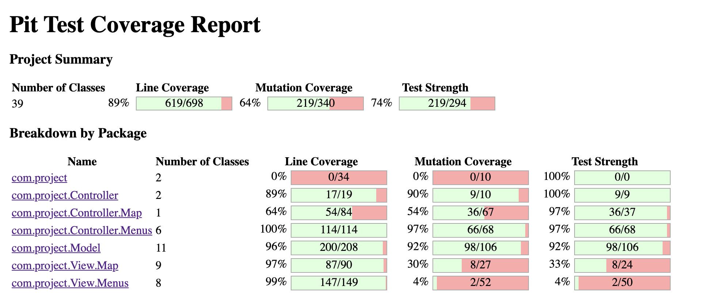

## LDTS_0801 - Tomb of the Mask

In this game, embark on an adventurous journey through labyrinths full of traps and challenges.  
The gameplay requires you to guide a character equipped with a mask that allows it to navigate through the maze by sticking to walls.  
However, you should be careful not to stick to the spikes! Contact with them will harm your character, leading to a game over...  
Navigate the labyrinth strategically, avoiding hazards and collecting all stars to reach the final destination. You can also collect coins along the way to enhance your score.

This project was developed by *Luís Freitas* (*up201905767*@fe.up.pt), *Mariana Marques* (*up201606434*@fe.up.pt), and *Pedro Marques* (*up202107525*@fe.up.pt) for LDTS 2023⁄24.

### IMPLEMENTED FEATURES

- **Main Menu** - Presented to the user upon opening the game. Allows the user to navigate to the Select Level or Help Menus.
- **Select Level Menu** - Showcases all available levels and the respective highest score achieved.
- **Help Menu** - Displays instructions for playing the game.
- **Levels** - There are different levels with increasing difficulty, labeled with ascending numbers.
- **Play** - The user chooses a level by pressing the corresponding keyboard number key.
- **Controls** - The game character will move according to keyboard input. It only stops once it reaches a wall:
  - <kbd>↑</kbd> Move Up
  - <kbd>↓</kbd> Move Down
  - <kbd>→</kbd> Move Right
  - <kbd>←</kbd> Move Left
- **Map** - A map has a path made of walls and obstacles.
- **Spikes** - Some of the arena's walls are made of spikes. If the character touches them, it looses the level.
- **Stars** - 3 stars are placed in each map. The character must collect them all to render the exit.
- **Open Buttons** - In level 2, there are buttons placed in the map that toggle specific walls.
- **Toggle Walls** - Walls that can be toggled by the Open Buttons.
- **Score** - Coins are placed in all accessible positions of the map. The character increases level score by collecting them.
- **Current Score** - The current score is showcased while playing the level.
- **Menu Access** - During each level, the user can press <kbd>P</kbd> to pause the game and open the Pause Menu.
- **Game Over** - Screen shown asking if the user wants to retry or return to the Main Menu.
- **Quitting** - The user can exit the game at any time by pressing <kbd>Q</kbd>.

### PLANNED FEATURES
- **Sound Effects** - Everytime the user collects an item or hits a spike, a sound effect is played.

The Sound Effects were implemented in the **sounds** branch. However, they caused the game to throw an exception in some laptops. Therefore, we opted to remove them from the final solution.

All the remaining planned features were implemented.

### SCREENSHOTS

**GAMEPLAY LVL 1**

**GAMEPLAY LVL 2**

**PAUSE**

**VICTORY**

### DESIGN

#### ORGANIZATION OF THE CODE

**Problem in Context**  
The game development process involves the implementation of numerous features. Therefore it needs a well-defined structure to enhance code readability, scalability, and maintainability.  

**The Pattern**

To address this problem, we've opted for the **Model-View-Controller (MVC)** architectural pattern. MVC separates concerns by organizing the implementation into three interconnected components:

- **Model:** represents the game's data. For example, for the elements of the game (the character, walls, stars, etc.)
- **View:** displays the model's data and sends user actions to the controller for it to interpret them.
- **Controller:** handles user actions and interacts with the model accordingly. 

**Implementation**

The implementation of the MVC pattern required organizing the code into three directories (**Model**, **View**, and **Controller**). Within these directories, classes were organized to contain the functionalities that aligned with the respective directory role.

The following figure displays how the **View** was built for this game.

The following figure displays how the **Controller** was built for this game.

The following figure displays how the **Model** was built for this game.

**Consequences**

The use of the MVC Pattern in the current design allows the following benefits:

- The separation of concerns into distinct components enhances code readability, making it easier to understand.
- The modular nature of MVC allows for easy development of new features without needing to make a lot of modifications to existing code.
- Each component has a clear responsibility, simplifying the process of maintaining the game.

#### REPEATED CODE TO RENDER ELEMENTS
**Problem in Context**  
We understood that the view of a wall and an exit and the view of a spike, a coin, a star, a openBtn, and a player are not so different from each other. Thus being a good idea to make all of this different classes implement a common class.

**The Pattern:**  
To address this problem, we used the **Factory Method Pattern:** this design pattern is described as to be a creational design pattern. This design pattern provides an interface for creating objects in a superclass, while allowing subclasses to change the type of objects that will be created.

**Implementation**  
Two factories were created:
- **BlockElementViewFactory |** used by the wall and exit
- **StringElementViewFactory |** used by the spike, coin, star, openBtn, and player

The factory is responsible for creating the element view but the elements are the ones that actually execute the creation.

**Consequences**  
By using the Factory Method Pattern, it is avoided the use of repeated code in each of the element's view class. Additionally, in the case of adding more features with similar behaviors but different contexts, we wouldn't have to make changes to the whole class.

#### GAME CLASS CAN ONLY BE INSTANCED ONCE
**Problem in Context**  
We need to make sure that our Game class has one, and only one instance in our application.

**The Pattern**  
To address this problem we used the **Singleton Pattern**.
This pattern guarantees that a class has only one instance and that only one global access point is provided to the one instance.

**Implementation**  
The implementation consisted of making the Game class constructor private and creating a single instance of the class inside Game. The single instance can be obtained through a getter method. 

**Consequences**  
By using this pattern we make sure that there is one, and only one global point of access to a class. It also results from its use that this class itself is only allowed to have one instance in our code and the only instance created must be extensible by subclassing.

## Testing

### Screenshot of coverage report

### Screenshot of mutation testing report

### Link to mutation testing report
[Mutation tests](pitest/index.html)

### Self-Evaluation

- Mariana Marques: 70%
- Luís Freitas: 15%
- Pedro Marques: 15%
